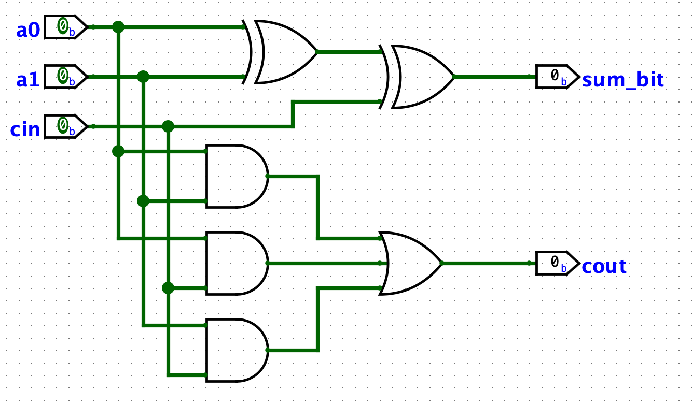

# Arithmetic Logic Unit (ALU) - Simplified 8-bit CPU

This repository contains a simplified 8-bit CPU designed to execute instructions in a single cycle. The Arithmetic Logic Unit (ALU) supports operations such as *addition*, *subtraction*, *comparison*, *bit shift*, and *multiplication*. The circuit can select the appropriate operation based on the provided opcodes.

 

> This project was created using Logisim. To run it, install the software available [here](https://github.com/logisim-evolution/logisim-evolution).

## Sum and Subtraction

### Sum circuit

To create an 8-bit adder, a sequence of 1-bit adders was connected in series. Each 1-bit adder adds the input bits `a0`, `a1`, and the "carry-in" bit (`cin`). The XOR gates perform the sum operation by first adding `a0` and `a1`, and then adding the result with `cin`, producing the sum bit. The AND gates identify input combinations that can generate a `cout` (carry out) which occurs when two or more inputs are 1. Finally, these outputs are combined by an OR gate, generating the "carry-out" and indicating if there is a carry-over in the addition process.

#### 1-bit adders:

 

The intermediate step was to create a 4-bit adder by connecting 1-bit adders in series. They work by passing the carry-out from the previous adder to the cin of the next adder.

- a0, a1, a2, a3: represent the bits of the first 4-bit binary number to be added.
- b0, b1, b2, b3: represent the bits of the second 4-bit binary number to be added.
- c0, c1, c2, c3: are the result bits of the addition of the corresponding bits from a and b, considering the carry.
- cin: is the "carry-in" or input carry. If there is a carry from the previous addition, it enters here.
- cout: is the "carry-out," which is the carry for the next addition if the sum of the 4 bits results in a number larger than 4 bits.

#### 4-bit adders:

 

Finally, following the same logic, an 8-bit adder was created by connecting two 4-bit adders in series.

#### 8-bit adders:

 

### Subtraction circuit

The adder circuit is capable of performing both addition and subtraction operations with 8-bit binary numbers using the two's complement method. In the two's complement subtraction method, to subtract one binary number from another, the two's complement of the number to be subtracted is added. The two's complement is obtained by inverting all the bits of the number and adding 1 to the result.

In this circuit, inputs `a0` to `a7` represent the first binary number, and inputs b0 to b7 represent the second. To perform a subtraction, the sub switch, located in the lower-left corner, controls whether the circuit executes an addition or a subtraction. When sub is activated (value 1), the circuit performs subtraction; when deactivated (value 0), it performs addition. In subtraction mode, the B bits are inverted by NOT gates, resulting in the one's complement. The decision to use the inverted value or the original value of B is made by the selector (Sel), which chooses based on the value of the sub input. If sub is activated, the selector uses the inverted value of B.

Additionally, the carry-in (`cin`) plays a crucial role. It adds 1 to the inverted value of B to complete the two's complement. The value of `cin` is also controlled by the sub input, so when the circuit is configured for subtraction, `cin` is activated, automatically adding 1.

The outputs `c0` to `c7` represent the final result of the operation. When the circuit is in addition mode (sub equal to 0), the result is the normal sum of A and B. In subtraction mode (sub equal to 1), the result is A - B, using the two's complement of B. Thus, the circuit can efficiently perform both addition and subtraction operations.

 

## Multiplier

## Comparator

## Bit Shift

## Video of the operation

video here
